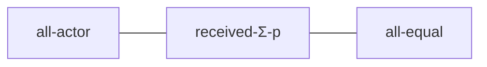
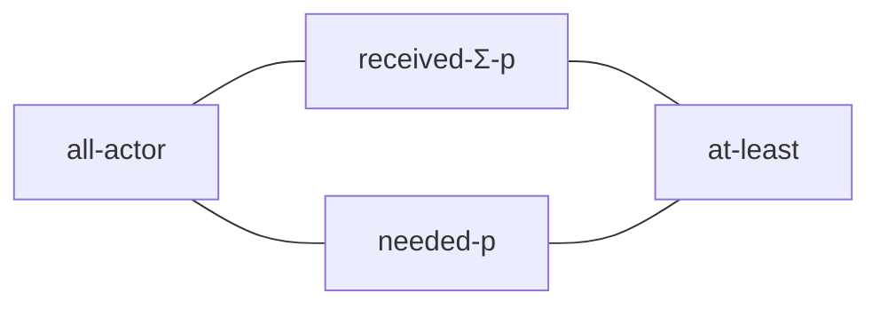
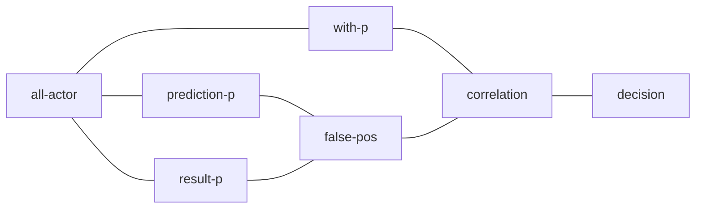

<head>
  
</head>

## Tiles

**Tiles** is a framework to create formal configurations of constraints. Its classes are
written in [Soda](https://julianmendez.github.io/soda) and grouped in packages translated to
[Scala](https://scala-lang.org).

The fairness tiles are defined in
[package tile](
https://github.com/julianmendez/soda/tree/master/tiles/src/main/scala/soda/tiles/fairness/tile
) [(Scala translation)](
https://github.com/julianmendez/soda/blob/master/tiles/src/main/scala/soda/tiles/fairness/tile/Package.scala
) and they use entities and other tools defined in
[package tool](
https://github.com/julianmendez/soda/tree/master/tiles/src/main/scala/soda/tiles/fairness/tool
) [(Scala translation)](
https://github.com/julianmendez/soda/blob/master/tiles/src/main/scala/soda/tiles/fairness/tool/Package.scala
).

### Resource Allocation Scenarios

These are some of the implemented fairness tiles for resource allocation scenarios:

| Tile                                                 | Class                                                                                                                                        |
|:-----------------------------------------------------|:---------------------------------------------------------------------------------------------------------------------------------------------|
| all-actor *(a)*                           | [AllActorTile](https://github.com/julianmendez/soda/blob/master/tiles/src/main/scala/soda/tiles/fairness/tile/AllActorTile.soda)             |
| *(a)* received-&Sigma;-p *(m)* | [ReceivedSigmaPTile](https://github.com/julianmendez/soda/blob/master/tiles/src/main/scala/soda/tiles/fairness/tile/ReceivedSigmaPTile.soda) |
| *(m)* all-equal *b*            | [AllEqualTile](https://github.com/julianmendez/soda/blob/master/tiles/src/main/scala/soda/tiles/fairness/tile/AllEqualTile.soda)             |
| *(a)* needed-p *(m)*           | [NeededPTile](https://github.com/julianmendez/soda/blob/master/tiles/src/main/scala/soda/tiles/fairness/tile/NeededPTile.soda)               |
| *(m0, m1)* at-least *b*        | [AtLeastTile](https://github.com/julianmendez/soda/blob/master/tiles/src/main/scala/soda/tiles/fairness/tile/AtLeastTile.soda)               |
| equality *b*                              | [EqualityTile](https://github.com/julianmendez/soda/blob/master/tiles/src/main/scala/soda/tiles/fairness/tile/EqualityTile.soda)             |
| equity *b*                                | [EquityTile](https://github.com/julianmendez/soda/blob/master/tiles/src/main/scala/soda/tiles/fairness/tile/EquityTile.soda)                 |

A specific scenario is given as an example in [ResourceAllocationScenarioExample](https://github.com/julianmendez/soda/blob/master/tiles/src/test/scala/soda/tiles/fairness/tile/ResourceAllocationScenarioExample.soda).
This scenario is used to test the equality tile with [EqualityTileSpec](https://github.com/julianmendez/soda/blob/master/tiles/src/test/scala/soda/tiles/fairness/tile/EqualityTileSpec.soda) and the equity tile with [EquityTileSpec](https://github.com/julianmendez/soda/blob/master/tiles/src/test/scala/soda/tiles/fairness/tile/EquityTileSpec.soda).

#### Equality

#### Equity

### Scoring Scenarios

These are some of the implemented fairness tiles for scoring scenarios:

| Tile                                             | Class                                                                                                                                        |
|:-------------------------------------------------|:---------------------------------------------------------------------------------------------------------------------------------------------|
| all-actor *(a0, a1, a2)*              | [AllActorTripleTile](https://github.com/julianmendez/soda/blob/master/tiles/src/main/scala/soda/tiles/fairness/tile/AllActorTripleTile.soda) |
| *(a)* prediction-p *(m)*   | [PredictionPTile](https://github.com/julianmendez/soda/blob/master/tiles/src/main/scala/soda/tiles/fairness/tile/PredictionPTile.soda)       |
| *(a)* result-p *(m)*       | [ResultPTile](https://github.com/julianmendez/soda/blob/master/tiles/src/main/scala/soda/tiles/fairness/tile/ResultPTile.soda)               |
| *(m0, m1)* false-pos *(m)* | [FalsePosTile](https://github.com/julianmendez/soda/blob/master/tiles/src/main/scala/soda/tiles/fairness/tile/FalsePosTile.soda)             |
| *(a)* with-p *(m)*         | [WithPTile](https://github.com/julianmendez/soda/blob/master/tiles/src/main/scala/soda/tiles/fairness/tile/WithPTile.soda)                   |
| *(m0, m1)* correlation *m* | [CorrelationTile](https://github.com/julianmendez/soda/blob/master/tiles/src/main/scala/soda/tiles/fairness/tile/CorrelationTile.soda)       |
| *m* decision *b*           | [DecisionTile](https://github.com/julianmendez/soda/blob/master/tiles/src/main/scala/soda/tiles/fairness/tile/DecisionTile.soda)             |
| unbiasedness *b*                      | [UnbiasednessTile](https://github.com/julianmendez/soda/blob/master/tiles/src/main/scala/soda/tiles/fairness/tile/UnbiasednessTile.soda)     |

A specific scenario is given as an example in [ScoringScenarioExample](https://github.com/julianmendez/soda/blob/master/tiles/src/test/scala/soda/tiles/fairness/tile/ScoringScenarioExample.soda).
This scenario is used to test the scoring scenario tile (unbiasedness with respect to false positives) with
[UnbiasednessTileSpec](https://github.com/julianmendez/soda/blob/master/tiles/src/test/scala/soda/tiles/fairness/tile/UnbiasednessTileSpec.soda).

#### Unbiasedness

### Auxiliary Tiles

The auxiliary tiles are used in the construction of other tiles. Some of the auxiliary tiles
are:

| Tile                                                                     | Class                                                                                                                                 |
|:-------------------------------------------------------------------------|:--------------------------------------------------------------------------------------------------------------------------------------|
| *(a)* attribute-p *(m)*                            | [AttributePTile](https://github.com/julianmendez/soda/blob/master/tiles/src/main/scala/soda/tiles/fairness/tile/AttributePTile.soda)  |
| *(m0, m1)* &Sigma;-p *(m)*                         | [SigmaTile](https://github.com/julianmendez/soda/blob/master/tiles/src/main/scala/soda/tiles/fairness/tile/FalsePosTile.soda)         |
| *(&alpha;0) (&alpha;1)* zip *(&alpha;0, &alpha;1)* | [ZipTile](https://github.com/julianmendez/soda/blob/master/tiles/src/main/scala/soda/tiles/fairness/tile/ZipTile.soda)                |
| *(&alpha;0, &alpha;1)* unzip-0 *(&alpha;0)*        | [UnzipPairFstTile](https://github.com/julianmendez/soda/blob/master/tiles/src/main/scala/soda/tiles/fairness/tile/UnzipPairTile.soda) |
| *(&alpha;0, &alpha;1)* unzip-1 *(&alpha;1)*        | [UnzipPairSndTile](https://github.com/julianmendez/soda/blob/master/tiles/src/main/scala/soda/tiles/fairness/tile/UnzipPairTile.soda) |

